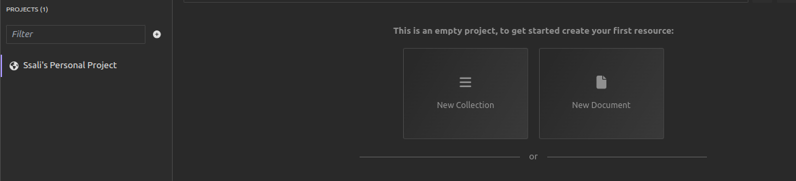
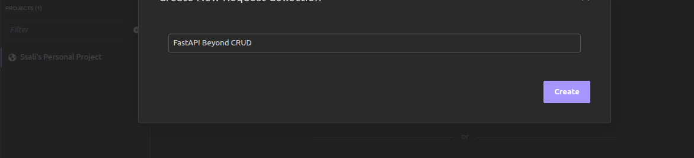

# FastAPI Beyond CRUD (Chapter Two)

## Creating a Simple Web Server

At this stage, our directory structure is as follows:
```
└── env
```

Let's create a file named `main.py` and populate it with the following code:

```python
from fastapi import FastAPI

app = FastAPI()

@app.get('/')
async def read_root():
    return {"message": "Hello World!"}
```

### Understanding the Code

In this code snippet, we perform the following actions:

1. **Importing FastAPI Class:**
   We import the `FastAPI` class from the `fastapi` library. This class serves as the primary entry point for all FastAPI applications. We then create an instance of our FastAPI application named `app`.

    ```python
    from fastapi import FastAPI

    app = FastAPI()
    ```

2. **Creating an API Endpoint:**
   We define our first API endpoint by creating a function named `read_root`. This function, when accessed, will return a JSON message containing "Hello World!".

    ```python
    @app.get('/')
    async def read_root():
        return {"message": "Hello World!"}
    ```

   The `@app.get('/')` decorator associates the `read_root` function with the HTTP GET method for the root path (`/`). This means that whenever the `/` route is accessed, the defined message will be returned.

3. **Running the FastAPI Application:**
   To run our FastAPI application, we use Uvicorn. Open a terminal and execute the following command within the virtual environment:

    ```bash
    uvicorn main:app --reload
    ```

   This command tells Uvicorn to run the `app` instance from the `main` module, and the `--reload` flag enables automatic code reloading during development.

Running the server will expose the application to the following address, `http://localhost:8000`

By following these steps, you have successfully set up a simple FastAPI application with an endpoint that responds with a greeting. Additionally, you've learned how to run the application using Uvicorn, facilitating the development process with automatic code reloading. 

Depending on your choice, you may want to test your application with an Api Client, I will begin with [Insomnia](https://insomina.rest) which is a simple open source application for testing and development APIs.

In insomnia, we shall create our simple request collection and we shall now see our response of `Hello World`.
1. Create a new request collection



2. Name the request collection


3. Create an HTTP request


4. Make a request


And just like that, you have created your FastAPI application, run it and even made your HTTP request using an HTTP client.

**Next** [Creating a simple CRUD API](./chapter3.md)

**Previous** [Installation and Configuration](./index.md)