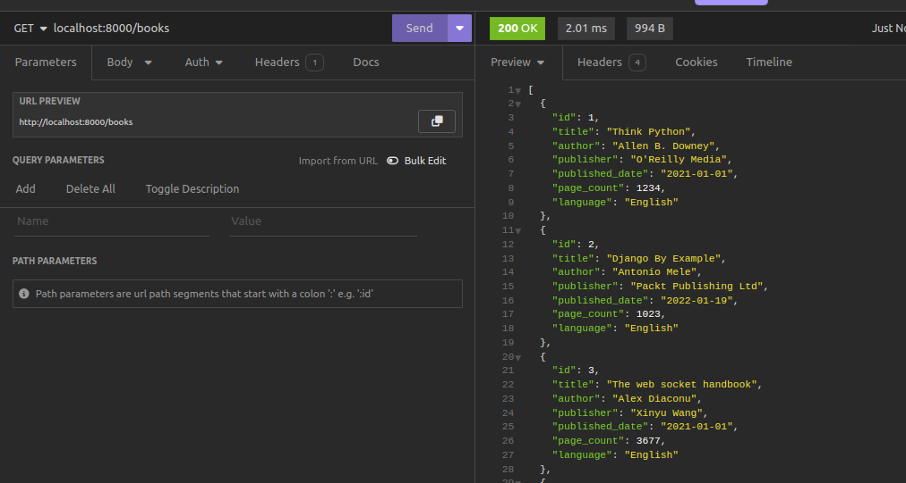
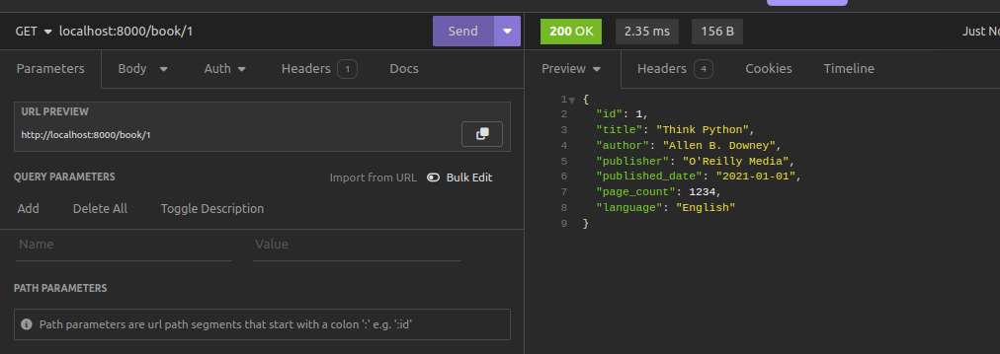
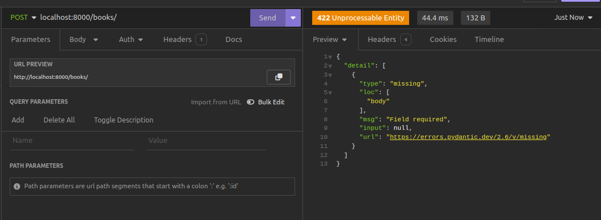
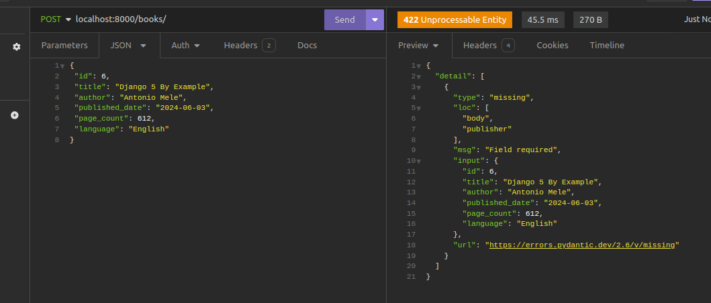
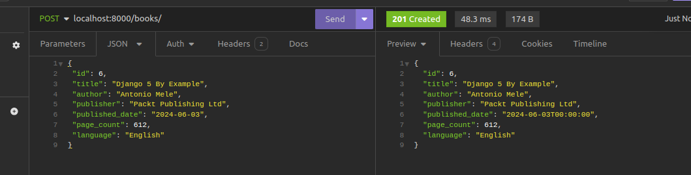
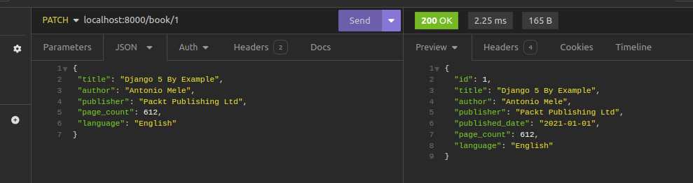
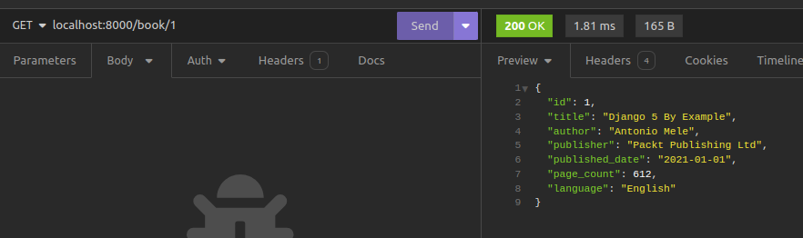
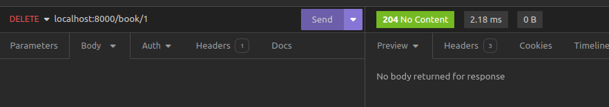

# FastAPI Beyond CRUD (Chapter Three)

Contents of the chapter
- [What is CRUD?](#what-is-crud)
- [Using HTTP GET to read all books](#reading-all-books-http-get-request)
- [Using HTTP GET to retrieve a single Book](#read-one-book-http-get-request)
- [Using HTTP POST to create a book](#adding-a-new-book-using-http-post)
- [Using HTTP PATCH to update a book](#update-a-book-http-patch-request)
- [Using HTTP DELETE to delete a book](#delete-a-book-http-delete-request)


## What is CRUD?

CRUD represents the four basic data operations:

- **Create (C):**

  - _Objective:_ Add new data.
  - _Action:_ Insert a new record or entity.

- **Read (R):**

  - _Objective:_ Retrieve existing data.
  - _Action:_ Fetch data without modification.

- **Update (U):**

  - _Objective:_ Modify existing data.
  - _Action:_ Update attributes or values.

- **Delete (D):**
  - _Objective:_ Remove data.
  - _Action:_ Delete a record or entity.

CRUD operations are fundamental in data management, commonly used in applications dealing with data persistence. In **FastAPI Beyond CRUD**, the focus is on extending FastAPI capabilities beyond typical CRUD applications, exploring advanced features and use cases. But before diving into such aspects, let us build a simple CRUD API using FastAPI.

### A simple CRUD API implementation
Our simple CRUD API will have a few endpoints to perform CRUD operations on a simple in-memory database of books. Here's a list of endpoints that we shall have in our CRUD API.

| Endpoint        | Method | Description         |
| --------------- | ------ | ------------------- |
| /books          | Get    | Read all books      |
| /books          | POST   | Create a book       |
| /book/{book_id} | GET    | Get a book by id    |
| /book/{book_id} | PATCH  | Update a book by id |
| /book/{book_id} | DELETE | Delete a book by id |

The provided table describes various API endpoints, their associated HTTP methods, and their functionalities:

1. **`/books` - GET: Read all books**

   - _Description:_ This endpoint is designed to retrieve information about all available books. When a client makes an HTTP GET request to `/books`, the server responds by providing details on all books in the system.

2. **`/books` - POST: Create a book**

   - _Description:_ To add a new book to the system, clients can make an HTTP POST request to `/books`. This operation involves creating and storing a new book based on the data provided in the request body.

3. **`/book/{book_id}` - GET: Get a book by id**

   - _Description:_ By making an HTTP GET request to `/book/{book_id}`, clients can retrieve detailed information about a specific book. The `book_id` parameter in the path specifies which book to fetch.

4. **`/book/{book_id}` - PATCH: Update a book by id**

   - _Description:_ To modify the information of a specific book, clients can send an HTTP PATCH request to `/book/{book_id}`. The `book_id` parameter identifies the target book, and the request body contains the updated data.

5. **`/book/{book_id}` - DELETE: Delete a book by id**
   - _Description:_ This endpoint allows clients to delete a specific book from the system. By sending an HTTP DELETE request to `/book/{book_id}`, the book identified by `book_id` will be removed from the records.

Now that we have a plan of our simple API, we can now build our simple CRUD API by adding the following code to `main.py`. We shall begin by creating a very simple list of books that we will use as our database.

```python
# in memory database of the books
books = [
    {
        "id": 1,
        "title": "Think Python",
        "author": "Allen B. Downey",
        "publisher": "O'Reilly Media",
        "published_date": "2021-01-01",
        "page_count": 1234,
        "language": "English",
    },
    {
        "id": 2,
        "title": "Django By Example",
        "author": "Antonio Mele",
        "publisher": "Packt Publishing Ltd",
        "published_date": "2022-01-19",
        "page_count": 1023,
        "language": "English",
    },
    {
        "id": 3,
        "title": "The web socket handbook",
        "author": "Alex Diaconu",
        "publisher": "Xinyu Wang",
        "published_date": "2021-01-01",
        "page_count": 3677,
        "language": "English",
    },
    {
        "id": 4,
        "title": "Head first Javascript",
        "author": "Hellen Smith",
        "publisher": "Oreilly Media",
        "published_date": "2021-01-01",
        "page_count": 540,
        "language": "English",
    },
    {
        "id": 5,
        "title": "Algorithms and Data Structures In Python",
        "author": "Kent Lee",
        "publisher": "Springer, Inc",
        "published_date": "2021-01-01",
        "page_count": 9282,
        "language": "English",
    },
    {
        "id": 6,
        "title": "Head First HTML5 Programming",
        "author": "Eric T Freeman",
        "publisher": "O'Reilly Media",
        "published_date": "2011-21-01",
        "page_count": 3006,
        "language": "English",
    },
]
```

Once we have that, we shall build our endpoints on the simple database.

```python
rom fastapi import FastAPI, Query
from schemas import BookSchema,BookUpdateSchema

@app.get("/books")
async def read_books():
    """Read all books"""
    return books

@app.get('/book/{book_id}')
async def read_book(book_id: int):
    """Read a book"""
    for book in books:
        if book['id'] == book_id:
            return book
    return {"message": "Book not found"}

@app.post('/books',status_code=201)
async def create_book(book: BookSchema):
    """Create a new book"""
    books.append(book)
    return book

@app.patch('/book/{book_id}')
async def update_book(book_id: int, update_data: BookUpdateSchema):
    """"update book """
    for book in books:
        if book['id'] == book_id:
            book['title'] = update_data.title
            book['author'] = update_data.author
            book['publisher'] = update_data.publisher
            book['page_count'] = update_data.page_count
            book['language'] = update_data.language
            return book
    return {"message": "Book not found"}


@app.delete('/book/{book_id}',status_code=204)
async def delete_book(book_id: int):
    """delete a book"""
    for book in books:
        if book['id'] == book_id:
            books.remove(book)
            return book
    return {"message": "Book not found"}

```

## Reading All Books (HTTP GET request)

The initial API endpoint is `/books`, designed to retrieve all the books stored in the database and present them in a list. This is accomplished by implementing the `read_books` function, which, when invoked, returns the `books` list.

```python
@app.get("/books")
async def read_books():
    return books
```

FastAPI significantly simplifies the process of returning any JSON serializable object as a response.

### Note

JSON (JavaScript Object Notation) serialization involves transforming a data structure or object from a programming language (such as Python, JavaScript, or others) into a JSON-formatted string. This string representation can then be transmitted over a network or stored in a file, subsequently allowing deserialization back into the original data structure.

In Python, the following data types are serializable:

- Lists
- Dictionaries
- Strings
- Tuples
- Booleans
- None

This capability enables us to effortlessly respond with a list of book objects when issuing a `GET` request to `http://localhost:8000/books`, as illustrated below:




## Read one Book (HTTP GET request)
We retrieve a single book by its ID by calling the `read_book` function whenever we make a request to `book/{book_id}`. Note that the {book_id} is refered to as a **path parameter** that is even passed to the `read_book function to find the book with the given ID. All we have done is to iterate through the book list, and check if a book exists in the list with the given ID. If not found,, we shall return a message indicating that.

```python
@app.get('/book/{book_id}')
async def read_book(book_id: int):
    for book in books:
        if book['id'] == book_id:
            return book
    return {"message": "Book not found"}
```




## Adding a New Book (Using HTTP POST)

To insert a new book into our system, we need to create a blueprint for the book's details. FastAPI uses a tool called Pydantic for this, making sure the data follows specific rules. This helps validate the information we receive and ensures smooth communication with the database.

Let's break down the process step by step. First, we define a class for our book details, called `BookSchema`, and save it in a file named `schemas.py`:

```python
from pydantic import BaseModel
from datetime import datetime

class BookSchema(BaseModel):
    id: int
    title: str
    author: str
    publisher: str
    published_date: datetime
    page_count: int
    language: str
```

In simpler terms, this class represents a model for a book. It includes information like the book's ID, title, author, publisher, publication date, page count, and language.

Next, we create an endpoint to allow the addition of a new book. This endpoint expects data in the format specified by our `BookSchema`. The provided data is then added to our list of books. This process also ensures that the data sent to the server is valid and secure.

```python
@app.post('/books', status_code=201)
async def create_book(book: BookSchema):
    books.append(book)
    return book
```

The `BookSchema` class ensures that the data sent to the server follows the expected format. If invalid data is submitted, the server responds with errors, as shown below when no data is sent:



Similarly, submitting incomplete or incorrect data results in validation errors:



On the other hand, sending valid JSON data to the server creates a new book record. The response includes a 201 Created status code:



### Note

It's crucial to use the right HTTP status code in each response. In this case, we use `status_code=201` to indicate the successful creation of a resource. The default status code is 200, which represents a standard successful response.


## Update a book (HTTP PATCH request)
Let us look at the update endpoint. This is quite similar to the create endpoint as it allows data to be sent to the server via the **PATCH** HTTP method. But it also requires we provide the `book_id` of the book that we will be updating. we loop through the book list and find the book that matches the `book_id` as shown below:

```python
@app.patch('/book/{book_id}')
async def update_book(book_id: int, update_data: BookUpdateSchema):
    """"update book """
    for book in books:
        if book['id'] == book_id:
            book['title'] = update_data.title
            book['author'] = update_data.author
            book['publisher'] = update_data.publisher
            book['page_count'] = update_data.page_count
            book['language'] = update_data.language
            return book
    return {"message": "Book not found"}
```

If you notice, we have added the `update_data` parameter to our handler function and this is to be the validator for the data we shall use to update the book record. Notice this has a different schema called `BookUpdateSchema`. In our **schemas.py**, let us add the following code.

```python
class BookUpdateSchema(BaseModel):
    title:str
    author:str
    publisher:str
    page_count:int
    language:str
```

Notice how we have neglected some of the fields that are available in our Book structure as shown in our list of books. This is to ensure that we only send those fields that will be updated. Let us update our book record.



Let us confirm if our book record has been updated successfully. To do so we are going to retrieve the book by its ID. The book record has been updated successfully.




## Delete a book (HTTP Delete request)
Let us finally look at deletion of the book record. This is carried out in the following example:

```python
@app.delete('/book/{book_id}',status_code=204)
async def delete_book(book_id: int):
    """delete a book"""
    for book in books:
        if book['id'] == book_id:
            books.remove(book)
            return book
    return {"message": "Book not found"}
```
What we have here is to loop through the books and find the book associated with the given `book_id` the we remove it from the list of books by using the `remove` list method. Notice that we are return a 204 response status code. This means that we have deleted the book and therefore we shall not return any content as shown below.




And just like that, we have created a CRUD REST API using a simple in memory database. 


**Previous** [Creating a Simple Web Server](./index.md)

**Next** [Improved Project Structure Using Routers](./chapter4.md)
