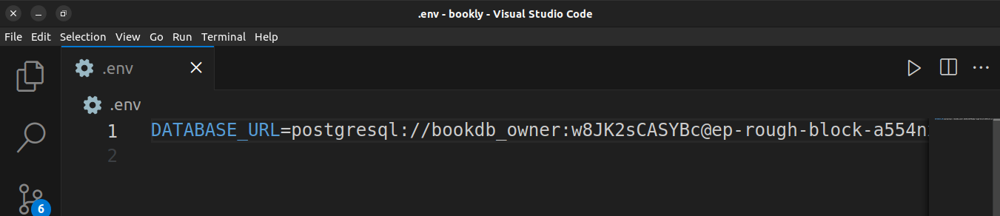

# Chapter Four: Databases with SQLModel in FastAPI

In the previous chapter, we developed a functional CRUD API that operated on a simple in-memory database, represented by a Python list. However, in real-world applications, it's essential to use a persistent database to store all necessary data.

## Choosing a Database for FastAPI

FastAPI supports various types of databases, including relational/SQL databases and non-relational/NoSQL databases. Depending on your specific requirements, you can opt for either type.

For this series, we'll focus on using a relational database, specifically PostgreSQL. PostgreSQL is a widely used free and open-source relational database management system, offering numerous benefits:

## Benefits of Using PostgreSQL

- **Advanced Features**: PostgreSQL provides extensive features, including support for complex SQL queries, ACID transactions, and advanced indexing options.

- **Extensibility**: Developers can enhance PostgreSQL's functionality through custom data types, functions, and procedural languages.

- **Scalability**: PostgreSQL efficiently handles large data volumes and high traffic using features like partitioning and parallel query processing.

- **Community Support**: With a large and active community, PostgreSQL enjoys continuous development, support, and knowledge sharing.

- **Security**: Robust security features like SSL encryption and fine-grained access control ensure data integrity and confidentiality.

- **Cross-platform Compatibility**: PostgreSQL is compatible with various operating systems, making it suitable for diverse deployment scenarios.

- **Cost-effectiveness**: Being an open-source solution, PostgreSQL is free to use, resulting in significant cost savings.

- **Compliance**: PostgreSQL adheres to SQL standards and complies with industry regulations such as GDPR and HIPAA.


While using PostgreSQL, we shall need to choose a way to interact with the database using the Python Language. That introduces us to the concept of an [Object Relational mapper](https://en.wikipedia.org/wiki/Object%E2%80%93relational_mapping).

## Explaining an Object-Relational Mapper (ORM)

An Object-Relational Mapper (ORM) serves as a translator between a programming language, such as Python, and a database, like PostgreSQL or MySQL.

In simpler terms, think of an ORM as an interpreter in a conversation where one person speaks English (Python) and the other speaks French (database). The ORM understands both languages, allowing you to interact with the database using familiar Python code without needing to understand the intricacies of how the database works internally.

### How it Works:

1. **Mapping Objects to Tables**: You create Python classes to represent tables in the database. Each object of these classes corresponds to a row in the database table.

2. **Interacting with Data**: You can then interact with these Python objects as if they were regular objects in your code, like setting attributes and calling methods.

3. **Behind the Scenes**: When you perform operations on these objects, like saving or deleting, the ORM translates these actions into the appropriate SQL queries that the database understands.

4. **Data Conversion**: The ORM handles converting Python data types into database-specific types and vice versa, ensuring compatibility between the two.

An ORM simplifies the process of working with databases by allowing you to focus on your application's logic in Python, rather than getting bogged down in SQL queries and database management details. It acts as a bridge between the object-oriented world of programming and the relational world of databases.

There are several different ORM solutions available for Python, but the most popular is [SQLAlchemy](https://sqlalchemy.org). SQLAlchemy simplifies database access and manipulation by providing an ORM for mapping Python objects to database tables and offering a high-level SQL expression language for querying databases. While SQLAlchemy is a powerful tool on its own, there's an ORM solution that seamlessly integrates SQLAlchemy with Pydantic, the data validation library discussed in previous chapters.

In this series, we will make use of [SQLModel](https://sqlmodel.tiangolo.com/), a library tailored for FastAPI. Interestingly, it was developed by the same individual who created FastAPI.

Let's initiate the database setup. Setting up a database can be intricate, often involving multiple steps. Fortunately, numerous options are available that simplify the database creation process without extensive configuration.

Throughout this course, I'll utilize [Neon](https://neon.tech/), a free fully managed PostgreSQL database with a generous free tier. With Neon, we can swiftly create a database and get started without delay.


Once you have created your free account on Neon, you can create a new project and in it you will also create you new database.


Once you have created your database, you can then go ahead and copy your connection details. 


After, Create a file called `.env` in which we shall store our project oncifgurations as secrets. (This file is important and should not be added to version control) In your `.env` file, paste the database connection URL you have obtained from Neon. We are going to  create an environment variable called `DATABASE_URL` with the value of our URL.





At this point, your folder structure needs to look something like this:
```console
|__ .env
├── env/
├── main.py
├── requirements.txt
└── schemas.py
└── src/
    └── __init__.py
    └── books/
        └── __init__.py
        └── routes.py
        └── schemas.py
        └── book_data.py
```

With that in place, we can now set up our configurations wo that we can read them out from anywhere within our application. Let us begine by creating a `config.py` file that contains the configuration variables that will be used in this series.

We are gonna rely on Pydantic to read our environment variables. Pydantic alone will not help us, we shall need to install `pydantic-settings`, a library that  is based on Pydantic to help us with with the specific role of reading environment variables from our `.env` file. 


So let us start by installing 

````bash
$ pip install pydantic-settings
````
After installing `pydantic-settings`, let us now go ahead and create a file called `config.py` at the root of our project.  Inside that file, add the following code.


```python
# inside the config.py
from pydantic_settings import BaseSettings


class Settings(BaseSettings):
    DATABASE_URL: str = "sqlite:///db.sqlite3"
```

### Explanation:

In the provided code snippet, we've performed the following actions:

1. Imported the `BaseSettings` class from `pydantic_settings`.
2. Created a subclass called `Settings`, inheriting from `BaseSettings`.
3. Defined an attribute named `DATABASE_URL` with a type annotation of `str`.
4. Set a default value of `"sqlite:///db.sqlite3"` for `DATABASE_URL`.

This configuration allows us to read the `DATABASE_URL` from the environment variables. If it's not provided, it falls back to the default value, `"sqlite:///db.sqlite3"`.

Now, let's see how this setup works. We'll open a Python interpreter shell to test it:

```bash
$ python3
```


**Previous**: [Improved Project Structure Using Routers](./chapter4.md)

**Next**: [Next Chapter](./chapter5.md)

